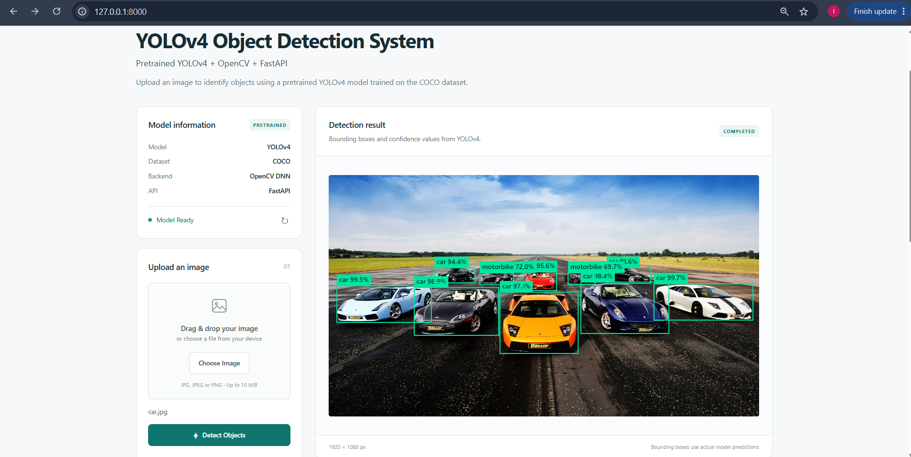
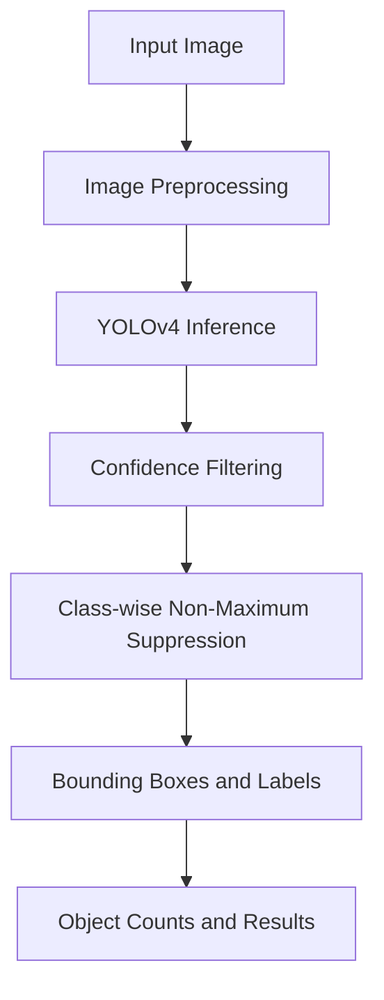
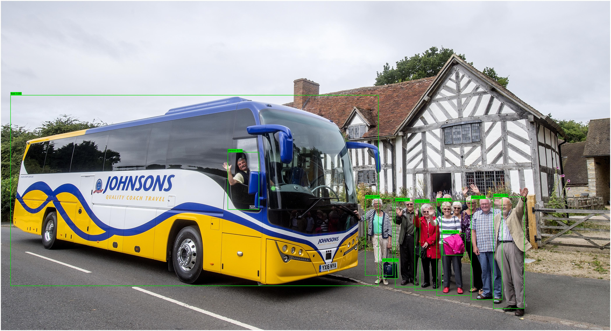
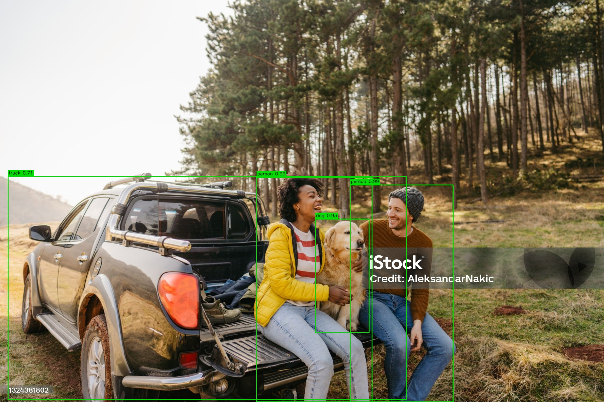
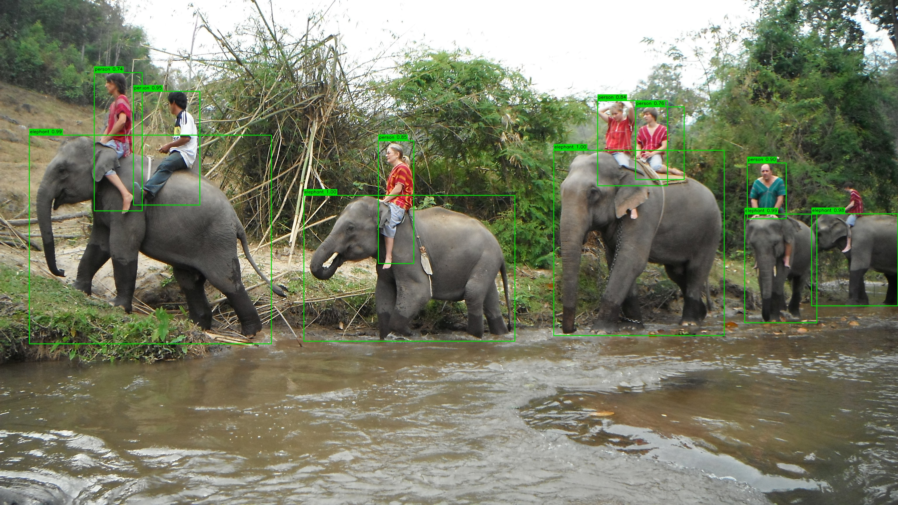
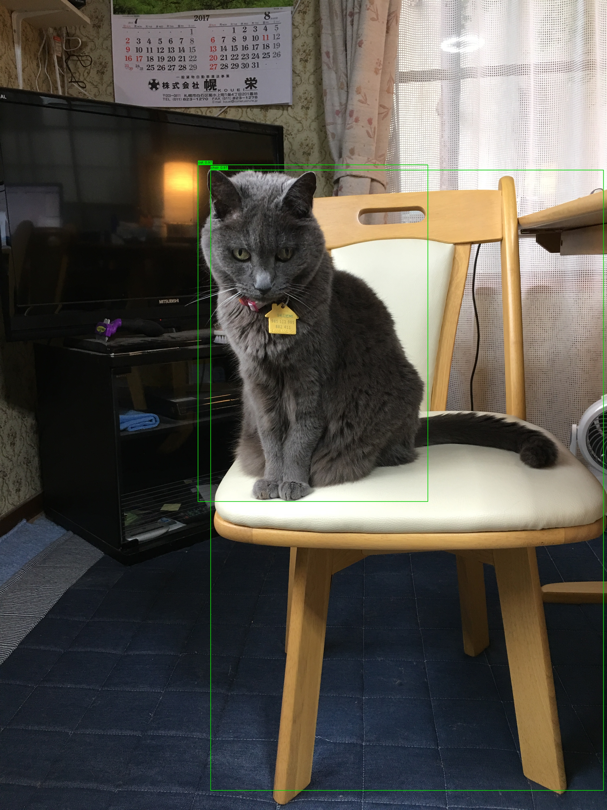

# YOLOv4 Object Detection System

An academic image-based object detection project using **pretrained YOLOv4**, **OpenCV DNN**, and a lightweight browser demo served by **FastAPI**.

## Overview

This project detects and labels objects in still images using YOLOv4 pretrained on the COCO dataset. The original academic demo has been organized into a reusable detector, a configurable command-line interface (CLI), and a local browser/API demo for Python and model integration.

The project does **not** train YOLOv4 from scratch or use a custom training dataset. COCO is an external dataset, and no formal accuracy or mAP evaluation has been performed for this project.

## Web Dashboard

The project includes a lightweight browser interface for uploading images, running YOLOv4 detection, and viewing annotated results, detected categories, confidence scores, total detections, and inference time.



> The dashboard is served locally through FastAPI. Run `uvicorn app.api:app --reload` and open `http://127.0.0.1:8000`.

## Features

- Pretrained YOLOv4 object detection with 80 COCO class labels
- Configurable confidence filtering and class-wise Non-Maximum Suppression (NMS)
- Bounding boxes, class labels, and confidence scores
- Original-resolution annotations and object-category counts
- Automatically saved annotated images through the CLI
- Configurable CLI for a single image or all sample images
- Local inference timing for each image
- FastAPI upload endpoint with Swagger documentation
- Responsive HTML/CSS/vanilla JavaScript web interface
- Drag-and-drop image upload
- Browser canvas annotations, model status, and detection summaries

## Tech Stack

- Python
- OpenCV DNN
- NumPy
- YOLOv4
- COCO class labels
- FastAPI
- Uvicorn
- HTML
- CSS
- Vanilla JavaScript

No separate frontend build system is required.

## How It Works



OpenCV constructs an RGB blob scaled by `1/255` at `416 x 416` by default. Only the inference blob is resized; detections are mapped back to the original image dimensions.

Confidence filtering removes low-confidence detections, while class-wise Non-Maximum Suppression removes redundant overlapping boxes without suppressing detections from different object classes.

Inference timing covers the model inference stage only and is included as a local observation, not as a formal performance benchmark.

## Project Structure

```text
Object_Detection_Project/
|-- app/
|   |-- __init__.py
|   |-- detector.py
|   |-- api.py
|   |-- templates/
|   |   `-- index.html
|   `-- static/
|       |-- css/
|       |   `-- style.css
|       |-- js/
|       |   `-- app.js
|       `-- favicon.svg
|
|-- data/
|   `-- images/
|       |-- birds.jpg
|       |-- bus_people.jpg
|       |-- car_dog.jpg
|       |-- car.jpg
|       |-- cat_chair.jpg
|       |-- elephant.jpg
|       `-- people.jpg
|
|-- models/
|   |-- yolov4.cfg
|   |-- coco.names
|   `-- README.md
|
|-- results/
|   |-- .gitkeep
|   `-- *_detected.jpg
|
|-- docs/
|   `-- screenshots/
|       |-- Dashboard.png
|       |-- bus_people_detected.jpg
|       |-- car_dog_detected.jpg
|       |-- elephant_detected.jpg
|       |-- cat_chair_detected.jpg
|       |-- birds_detected.jpg
|       |-- car_detected.jpg
|       `-- people_detected.jpg
|
|-- tests/
|   |-- test_detector.py
|   `-- test_api.py
|
|-- main.py
|-- requirements.txt
|-- .gitignore
`-- README.md
```

`models/yolov4.weights` must be downloaded separately. Generated CLI images are stored in `results/` and may be ignored by Git, while curated screenshots in `docs/screenshots/` are included for GitHub documentation.

## Setup

Install **Python 3.12 or newer**.

Clone the repository and create a virtual environment:

```sh
git clone https://github.com/IreshaNethmini20/Object_Detection_Project.git
cd Object_Detection_Project
python -m venv .venv
```

### Windows PowerShell

```powershell
.\.venv\Scripts\Activate.ps1
```

### Windows Command Prompt

```bat
.venv\Scripts\activate.bat
```

### macOS/Linux

```sh
source .venv/bin/activate
```

Install dependencies:

```sh
python -m pip install -r requirements.txt
```

Download the full pretrained `yolov4.weights` from the official AlexeyAB Darknet YOLOv4 release and place it at:

```text
models/yolov4.weights
```

See `models/README.md` for model setup details.

Do not use YOLOv4-tiny weights with this configuration.

## Running the CLI

Run from the repository root.

### Detect objects in one image

```sh
python main.py --image data/images/bus_people.jpg
```

Another example:

```sh
python main.py --image data/images/elephant.jpg
```

Custom parameters:

```sh
python main.py --image data/images/bus_people.jpg --confidence 0.5 --nms-threshold 0.4 --input-size 416 --output-dir results
```

Press any key in the image window to close it.

For a terminal without a graphical display:

```sh
python main.py --image data/images/bus_people.jpg --no-display
```

### Process all sample images

```sh
python main.py --input-dir data/images --output-dir results --no-display
```

Generated output files follow this format:

```text
results/<image_name>_detected.jpg
```

For example:

```text
results/bus_people_detected.jpg
```

The CLI prints the detected categories, total detections, and local inference time.

To view all available CLI options:

```sh
python main.py --help
```

## Web Demo

Start the FastAPI server:

```sh
uvicorn app.api:app --reload
```

When the terminal shows:

```text
Uvicorn running on http://127.0.0.1:8000
Application startup complete.
```

the server is running successfully.

Open the web dashboard:

```text
http://127.0.0.1:8000
```

### Using the Dashboard

1. Choose or drag a JPG/JPEG/PNG image into the upload area.
2. Check that the model status shows **Model Ready**.
3. Preview the selected image.
4. Click **Detect Objects**.
5. View the bounding boxes, confidence percentages, category counts, total detections, and inference time.
6. Click **Clear / Try Another Image** to test another image.

The browser sends the selected image to the FastAPI `POST /detect` endpoint. The backend runs YOLOv4 inference and returns structured JSON results. JavaScript then draws the returned bounding boxes and labels on the browser canvas.

The default detection settings are:

- Confidence threshold: `0.50`
- NMS threshold: `0.40`
- YOLO input size: `416 x 416`

## FastAPI / Swagger Demo

The same server also provides interactive Swagger documentation.

Open:

```text
http://127.0.0.1:8000/docs
```

Then:

1. Expand `POST /detect`.
2. Click **Try it out**.
3. Upload a JPG/JPEG/PNG image.
4. Click **Execute**.
5. Inspect the returned JSON response.

The response contains:

- Uploaded filename
- Total detections
- Category counts
- Detected class IDs and names
- Confidence values
- Pixel bounding boxes
- Inference time

### API Routes

- `GET /` — serves the local HTML dashboard
- `GET /api/info` — returns basic API information
- `GET /health` — returns model availability
- `POST /detect` — validates and processes uploaded images
- `GET /docs` — Swagger API documentation

Uploads are limited to 10 MiB of compressed data.

## Detection Examples

The following are real annotated outputs generated by the project and copied from `results/`. They are included as visual demonstrations only and are not presented as formal accuracy measurements.

### Bus and People Detection



### Car and Dog Detection



### Elephant Detection



### Cat and Chair Detection



## Sample Images

Seven sample images are included for visual testing:

- Birds
- Bus and people
- Car and dog
- Car
- Cat and chair
- Elephant
- People

These images are demonstration inputs only. They are not a custom training dataset or a labeled evaluation dataset.

## What I Learned

Through this project, I gained practical experience with:

- YOLO object detection workflow
- OpenCV DNN inference
- Image preprocessing and blob creation
- Confidence thresholding
- Bounding-box coordinate handling
- Non-Maximum Suppression
- Reusable model integration
- FastAPI backend integration
- REST API testing
- Browser-based model interaction
- Visualizing structured AI inference results

## Limitations

- Uses pretrained YOLOv4; no custom YOLO training was performed
- Detection coverage is limited to pretrained COCO classes
- No formal mAP, precision, recall, or accuracy evaluation is reported
- CPU inference can be slower than GPU inference
- Direct blob resizing can distort non-square inputs
- Small, overlapping, or unusual objects may be missed or mislabeled
- This is an academic/local demonstration and is not production deployed

## Future Improvements

- Webcam and video detection
- Newer YOLO versions
- Custom dataset training
- GPU acceleration
- Formal evaluation using mAP, precision, and recall
- Docker deployment

## Quality Checks

With dependencies installed:

```sh
python -m compileall -q app main.py tests
python -c "import cv2, numpy, fastapi, uvicorn, multipart; import app.detector; import app.api"
python main.py --help
python -m unittest discover -s tests -v
```

The automated tests cover detector logic, NMS behavior, box clipping, file validation, API routes, response serialization, and missing model handling. They do not measure YOLO accuracy and do not require real model weights.

To verify real inference, download the YOLOv4 weights and run the CLI demo.

## Author

**Iresha Nethmini**  
Data Science Undergraduate

[GitHub](https://github.com/IreshaNethmini20)  
[LinkedIn](https://www.linkedin.com/in/iresha-nethmini)
