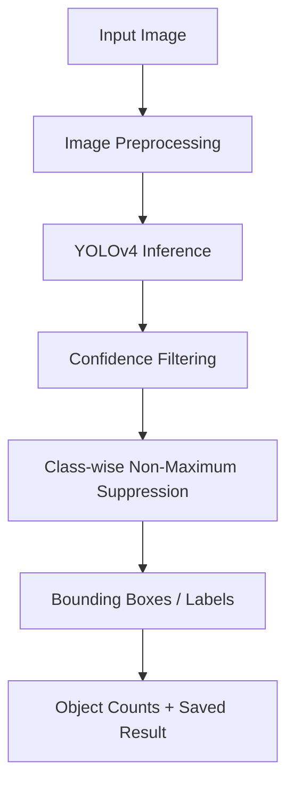

# YOLOv4 Object Detection System

An academic image-based object detection project using pretrained YOLOv4,
OpenCV DNN, and a small local FastAPI integration.

## Overview

This project detects and labels objects in still images using YOLOv4 pretrained
on COCO. The original academic demo has been organized into a reusable detector,
a configurable CLI, and a local API for demonstrating Python/model integration.
The project does not train YOLOv4 from scratch or create a custom dataset.
COCO is an external dataset; no accuracy or mAP has been measured here.

## Features

- Pretrained YOLOv4 object detection with 80 COCO class labels
- Configurable confidence filtering and class-wise Non-Maximum Suppression (NMS)
- Bounding boxes, readable class labels, and confidence scores
- Original-resolution annotations and object-category counts
- Automatically saved annotated images
- Configurable CLI for one image or all sample images
- Local inference timing for each image
- Optional FastAPI upload endpoint with Swagger documentation

## Tech Stack

Python, OpenCV DNN, NumPy, YOLOv4, COCO class labels, FastAPI, and Uvicorn.

## How It Works



OpenCV constructs an RGB blob scaled by 1/255 at 416 x 416 by default.
Only this inference blob is resized; detections are mapped back to the original
image dimensions. Direct resizing can distort aspect ratios, a limitation of
this simple demo. The CPU network is loaded once per CLI run or API process.

Confidence is objectness multiplied by class probability. OpenCV's Darknet
Region layer already returns that product in its class scores, so the detector
uses those scores directly. See the [OpenCV implementation](https://github.com/opencv/opencv/blob/4.x/modules/dnn/src/layers/region_layer.cpp).
Class-wise NMS removes redundant overlapping boxes without suppressing a
separate object category at the same location.

Timing covers `setInput` and `forward` only. It excludes loading, preprocessing,
postprocessing, drawing, saving, and queue waiting. It is a local observation,
not a formal benchmark; the first run can be slower.

## Project Structure

```text
Object_Detection_Project/
|-- app/
|   |-- __init__.py
|   |-- detector.py
|   `-- api.py
|-- data/images/
|   |-- birds.jpg
|   |-- bus_people.jpg
|   |-- car_dog.jpg
|   |-- car.jpg
|   |-- cat_chair.jpg
|   |-- elephant.jpg
|   `-- people.jpg
|-- models/
|   |-- yolov4.cfg
|   |-- coco.names
|   `-- README.md
|-- results/
|   `-- .gitkeep
|-- docs/screenshots/
|   `-- .gitkeep
|-- tests/
|   |-- test_detector.py
|   `-- test_api.py
|-- main.py
|-- requirements.txt
|-- .gitignore
`-- README.md
```

`models/yolov4.weights` is downloaded separately. Generated CLI images go in
`results/` and are ignored by Git; curated images in `docs/screenshots/` are
trackable. No detection screenshots are included until real inference is run.

## Setup

Install Python **3.12 or newer**. Run these commands in a terminal:

```sh
git clone https://github.com/IreshaNethmini20/Object_Detection_Project.git
cd Object_Detection_Project
python -m venv .venv
```

Windows PowerShell:

```powershell
.\.venv\Scripts\Activate.ps1
```

Windows Command Prompt:

```bat
.venv\Scripts\activate.bat
```

macOS/Linux:

```sh
source .venv/bin/activate
```

Then:

```sh
python -m pip install -r requirements.txt
```

Download full pretrained `yolov4.weights` from the official
[AlexeyAB Darknet YOLOv4 release](https://github.com/AlexeyAB/darknet/releases/tag/yolov4)
and place it at `models/yolov4.weights`. See [model setup](models/README.md).
Do not use YOLOv4-tiny weights with this configuration.

If Windows recognizes `py` but not `python`, use `py -3.12 -m venv .venv`.
If PowerShell activation is restricted, call `.\.venv\Scripts\python.exe`
and `.\.venv\Scripts\uvicorn.exe` directly instead of activating.

## Running the CLI

Run from the repository root:

```sh
python main.py --image data/images/bus_people.jpg
python main.py --image data/images/elephant.jpg
python main.py --image data/images/bus_people.jpg --confidence 0.5 --nms-threshold 0.4 --input-size 416 --output-dir results
```

Press any key in the image window to close it. Use `--no-display` in a terminal
without a graphical display. Original image dimensions are preserved.

Process all seven sample images, loading the model once:

```sh
python main.py --input-dir data/images --output-dir results --no-display
```

Output names follow `results/<image_stem>_detected.jpg`, for example
`results/bus_people_detected.jpg`. Rerunning overwrites those outputs.
The CLI prints actual category counts, total detections, and inference time.
No counts are predetermined. Input size must be a positive multiple of 32;
confidence and NMS thresholds must be in `(0, 1]`.

```sh
python main.py --help
```

Missing or invalid images and model files produce an error and nonzero exit
status. Batch processing reports per-image errors and continues after the first
image and model have been validated.

## Running the FastAPI Demo

From the repository root with the environment activated:

```sh
uvicorn app.api:app --reload
```

Open [Swagger UI](http://127.0.0.1:8000/docs). Expand `POST /detect`, select
**Try it out**, choose a JPG/JPEG/PNG image, and select **Execute**.
The response contains the filename, total detections, category counts,
detections (class ID/name, confidence, pixel bounding box), and inference time.
The API returns JSON; it does not save annotated images. Use the CLI to save them.

- `GET /` provides basic API information.
- `GET /health` returns `{"status": "ok", "model": "YOLOv4"}` when loaded.
- `POST /detect` validates file extension, MIME type, signature, and decoding.
  Uploads are limited to 10 MiB of compressed data.

If model loading fails, docs remain available, and health/detection return
HTTP 503. Check the server warning, add the missing files, then restart.
Invalid image contents return 400, unsupported formats 415, and oversized
uploads 413. A detector lock serializes network operations across requests.
This is a local demonstration of backend/model integration, not a production
service or deployment.

## Detection Examples

**Pending real inference:** the weights are not included and these screenshots
do not exist yet. Run the batch command above, then copy four generated outputs
using PowerShell:

```powershell
Copy-Item results/bus_people_detected.jpg docs/screenshots/bus_people_detection.jpg
Copy-Item results/car_dog_detected.jpg docs/screenshots/car_dog_detection.jpg
Copy-Item results/elephant_detected.jpg docs/screenshots/elephant_detection.jpg
Copy-Item results/cat_chair_detected.jpg docs/screenshots/cat_chair_detection.jpg
```

Once those files exist, uncomment the Markdown below and replace this pending
notice with a short description of the actual run. Commented image references
avoid broken images on GitHub before screenshots are generated.

<!--

Bus and people sample.


Car and dog sample.


Elephant sample.


Cat and chair sample.
-->

## Sample Images

Seven existing sample images cover birds, bus/people, car/dog, car, cat/chair,
elephant, and people scenes for visual testing of different categories. They
are demonstration inputs, not a custom training dataset or labeled evaluation
set. Their presence does not establish detection accuracy. Filenames containing
spaces or `&` were renamed; original image contents were preserved.

## What I Learned

This project explores the YOLO object-detection workflow, OpenCV DNN inference,
blob preprocessing, confidence thresholds, pixel bounding boxes, and NMS.
The refactor demonstrates reusable model integration and a small FastAPI
inference interface alongside the original image demo.

## Limitations

- Uses pretrained YOLOv4; no custom YOLO training was performed.
- Detection coverage depends on pretrained COCO classes.
- No measured mAP, precision, recall, or accuracy is reported.
- CPU inference may be slower than GPU inference.
- Direct blob resizing can distort non-square inputs.
- Small, overlapping, or unusual objects may be missed or mislabeled.
- Academic/demo project; not production deployed. Compressed upload size is
  limited, but this demo does not provide production resource controls.

## Future Improvements

- Webcam/video detection
- Newer YOLO versions
- Custom dataset training
- GPU acceleration
- Evaluation using labeled data and mAP/precision/recall
- Docker deployment

## Quality Checks

With dependencies installed:

```sh
python -m compileall -q app main.py tests
python -c "import cv2, numpy, fastapi, uvicorn, multipart; import app.detector; import app.api"
python main.py --help
python -m unittest discover -s tests -v
```

The regression tests use synthetic model outputs to check score handling,
class-wise NMS, box clipping, image preservation, path handling, and missing
model-file errors. They do not measure YOLO accuracy and do not require weights.
To verify real inference, download the weights and run the batch demo.

## Author

**Iresha Nethmini**

Data Science Undergraduate

[GitHub](https://github.com/IreshaNethmini20)

[LinkedIn](https://www.linkedin.com/in/iresha-nethmini)
